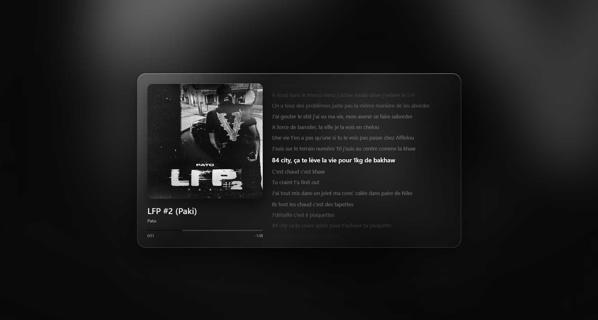

# Deezer Glass

**English** · [Français](README.fr.md)

A sober, high-fidelity **liquid-glass "now playing" visualizer for Deezer** on Windows — inspired by the full-screen Apple Music player. It shows the current track's cover, a "chameleon" background tinted to the artwork, time-synchronized (karaoke) lyrics, and — on demand — the music video, all behind a spectacular liquid-glass panel.

> **Deezer Glass does not play music.** It mirrors whatever Deezer is already playing, by reading the Windows "now playing" system (SMTC). You keep full tracks and your normal Deezer app — Deezer Glass just makes it beautiful.



---

## Features

- **Spectacular liquid glass.** A translucent, refractive glass panel with a living specular sheen, floating over the artwork.
- **Chameleon background.** The dominant colours of the album cover are extracted and drive the ambient background, the glass tint, and the accent — every track recolours the whole screen, and cross-fades on change.
- **Synchronized lyrics (karaoke).** The current line is highlighted and auto-scrolled in time with the song. Lyrics are fetched automatically from the best available source: **LRCLIB** for time-synced lyrics, falling back to **Genius** for plain lyrics when no synced version exists.
- **High-resolution cover.** The low-res Windows thumbnail is shown instantly, then upgraded to the full **1000×1000** cover from the **Deezer API** (with an **iTunes** fallback) across the art, the background, and the colour palette.
- **In-screen music video.** One click swaps the cover for the track's music video (**YouTube**), filling the glass panel for the highest resolution. The video is **muted** — audio stays on Deezer — and is seek-synchronized to the playback position.
- **Passive and sober.** No buttons in the way, generous negative space; a frameless window with hover-revealed controls and full-screen (F11).

---

## How it works

Deezer Glass is a **companion overlay**, not a player. Three pieces cooperate:

1. **SMTC bridge (native, Rust).** A small in-process Node addon (built with [napi-rs](https://napi.rs/) and the [`windows`](https://crates.io/crates/windows) crate) subscribes to `GlobalSystemMediaTransportControlsSessionManager` — the same Windows system that powers the media overlay. It emits the current title, artist, album, cover thumbnail, playback position and state to the app, event-driven. The cover is decoded only when the track changes (not on every position tick), to stay light.
2. **Main process (Electron / Node).** Receives those snapshots and forwards them to the interface. It also does all the network work (lyrics, high-res cover, clip resolution) on the Node side, so the interface makes no external requests itself.
3. **Renderer (Vite / TypeScript).** Owns every visual: the drifting blurred background, the liquid-glass panel, colour extraction, the synchronized lyrics, and the clip swap. Playback position is re-interpolated every frame for a smooth progress bar and sub-second lyric timing.

Because the audio is provided by Deezer, the visualizer is **artwork-driven** (like Apple Music), not a real-time audio spectrum.

---

## Requirements

**To run:**
- **Windows 10 or 11** (SMTC is Windows-specific — the app is Windows-only by design).
- **Deezer playing** — either the Deezer desktop app *or* the Deezer web player in a browser. Deezer Glass mirrors whichever media session Windows currently reports.

**To build from source:**
- **Node.js 18+**
- **Rust** (stable) — to compile the native SMTC addon.
- **MSVC build tools** (Visual Studio Build Tools) — the default Rust toolchain on Windows.

---

## Install and run (from source)

```bash
npm install
npm run build:native   # compiles the Rust SMTC addon into a .node binary
npm run dev            # launches the app (Electron + Vite dev server)
```

Start a track in Deezer and the window will show it.

### Build a Windows installer

```bash
npm run dist           # produces release/Deezer Glass-<version>-setup.exe
```

### Run the tests

```bash
npm test               # unit tests for the pure logic (lyrics, cover, palette, timing)
```

---

## Data sources

Everything is fetched anonymously in the main process — **no account and no API key required**:

| Data | Source | Notes |
|------|--------|-------|
| Now playing | Windows SMTC | The active media session on your PC |
| Synced lyrics | [LRCLIB](https://lrclib.net) | Free, open, time-synced (`.lrc`) |
| Plain lyrics fallback | [Genius](https://genius.com) | When no synced lyrics exist |
| High-res cover | [Deezer API](https://developers.deezer.com) → iTunes | 1000×1000 |
| Music video | YouTube | Muted, position-synced |

---

## Tech stack

Electron · electron-vite · TypeScript (renderer + main) · Rust + napi-rs + the `windows` crate (SMTC addon) · Vitest (unit tests) · electron-builder (Windows installer).

## Project structure

```
src/
  shared/     pure, unit-tested logic (normalization, lyrics/LRC, cover/lyrics providers, palette, timing)
  main/       Electron main: window, SMTC bridge, lyrics/cover/clip network + cache, IPC
  preload/    the safe bridge exposed to the interface
  renderer/   the interface (background, glass, lyrics, clip, palette, progress, chrome)
native/smtc/  the Rust SMTC addon (napi-rs)
docs/         design spec and implementation plan
```

---

## Notes

- **Windows only.** The whole approach relies on SMTC, which does not exist on macOS/Linux.
- **Lyrics/clip availability varies.** Synced lyrics need a source that has timestamps (LRCLIB); niche tracks may only get plain lyrics (Genius) or none. The clip is the first relevant YouTube result — accurate for mainstream tracks, best-effort otherwise.
- **Video quality** is served adaptively by YouTube based on the player size; the clip fills the panel and requests the highest quality, but exact resolution is YouTube's call.

---

## Author

**mitige** — sole author and contributor.
